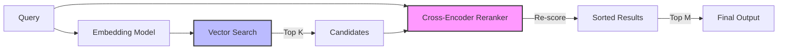
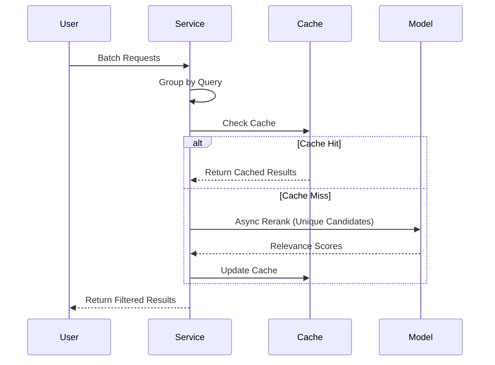

# Deep Dive: Module 1 - Reranking (Two-Step Retrieval with Cross-Encoders)

## 1. Advanced Theoretical Foundations

### The Mathematical Basis of Reranking

Reranking operates on the principle of **multi-stage retrieval optimization**. Unlike single-stage retrieval that relies on cosine similarity in embedding space, reranking introduces a **relevance refinement layer**:



**First Stage: Broad Recall**
`Query → Embedding → Vector Search → Top-K candidates (K=50-100)`

**Second Stage: Precision Filtering**
`Query + Candidates → Cross-Encoder → Relevance Scores → Top-M results (M=5-10)`

**Key Mathematical Concepts:**

- **Cross-attention mechanisms**: Unlike bi-encoders that use dot products, cross-encoders compute attention between every token in the query and every token in the document.
- **Pairwise ranking loss**: Models are trained using contrastive learning with positive and negative examples.
- **Score calibration**: Ensuring relevance scores are comparable across different queries.

### Cross-Encoder vs. Bi-Encoder Architecture

```python
# Bi-Encoder (Traditional Semantic Search)
query_embedding = encoder(query)
doc_embedding = encoder(document)
similarity = cosine_similarity(query_embedding, doc_embedding)

# Cross-Encoder (Reranking)
combined_input = "[CLS] " + query + " [SEP] " + document + " [SEP]"
combined_embedding = encoder(combined_input)
relevance_score = classification_head(combined_embedding)
```

**Critical Differences:**

- **Bi-encoders**: Pre-computable, fast, but limited to embedding similarity.
- **Cross-encoders**: Compute-intensive, but capture nuanced query-document interactions.

---

## 2. Extended Technical Implementation

### Advanced Code Implementation with Multiple Reranking Options

```python
import torch
from transformers import AutoTokenizer, AutoModelForSequenceClassification
from sentence_transformers import CrossEncoder
from typing import List, Dict
import numpy as np

class AdvancedReranker:
    def __init__(self, model_name: str = "cross-encoder/ms-marco-MiniLM-L-6-v2"):
        self.model = CrossEncoder(model_name)
        self.device = torch.device("cuda" if torch.cuda.is_available() else "cpu")

    def rerank_with_confidence(
        self,
        query: str,
        candidates: List[Dict],
        top_k: int = 10,
        score_threshold: float = 0.5
    ) -> List[Dict]:
        """
        Rerank candidates with confidence scoring and thresholding
        """
        # Prepare sentence pairs for cross-encoder
        sentence_pairs = [[query, candidate["text"]] for candidate in candidates]

        # Get similarity scores
        similarity_scores = self.model.predict(sentence_pairs)

        # Enhance candidates with scores and metadata
        for idx, candidate in enumerate(candidates):
            candidate["relevance_score"] = float(similarity_scores[idx])
            candidate["confidence"] = self._calculate_confidence(similarity_scores[idx])
            candidate["reranked_position"] = idx

        # Filter by threshold and sort
        filtered_candidates = [
            candidate for candidate in candidates
            if candidate["relevance_score"] >= score_threshold
        ]

        # Sort by relevance score
        filtered_candidates.sort(key=lambda x: x["relevance_score"], reverse=True)

        return filtered_candidates[:top_k]

    def _calculate_confidence(self, score: float) -> str:
        """Calculate confidence level based on score"""
        if score >= 0.8:
            return "high"
        elif score >= 0.5:
            return "medium"
        else:
            return "low"

    def batch_rerank(
        self,
        queries: List[str],
        candidates_list: List[List[Dict]],
        batch_size: int = 32
    ) -> List[List[Dict]]:
        """Batch processing for multiple queries"""
        results = []
        for i in range(0, len(queries), batch_size):
            batch_queries = queries[i:i+batch_size]
            batch_candidates = candidates_list[i:i+batch_size]

            batch_results = []
            for query, candidates in zip(batch_queries, batch_candidates):
                reranked = self.rerank_with_confidence(query, candidates)
                batch_results.append(reranked)

            results.extend(batch_results)

        return results

# Integration with LangChain for production systems
from langchain.retrievers import ContextualCompressionRetriever
from langchain.retrievers.document_compressors import CrossEncoderReranker
from langchain_community.vectorstores import Chroma
from langchain_openai import OpenAIEmbeddings

def create_production_reranking_pipeline():
    """Create a production-ready reranking pipeline"""

    # Initialize components
    embeddings = OpenAIEmbeddings(model="text-embedding-3-large")
    vectorstore = Chroma(persist_directory="./chroma_db", embedding_function=embeddings)

    # Create base retriever (broad recall)
    base_retriever = vectorstore.as_retriever(
        search_type="similarity",
        search_kwargs={"k": 100, "score_threshold": 0.3}
    )

    # Create reranker
    reranker = AdvancedReranker("cross-encoder/ms-marco-MiniLM-L-12-v2")

    # Create compression retriever
    compressor = CrossEncoderReranker(model=reranker.model, top_n=10)
    compression_retriever = ContextualCompressionRetriever(
        base_compressor=compressor,
        base_retriever=base_retriever
    )

    return compression_retriever
```

### Custom Reranking Model Training

```python
# Fine-tuning cross-encoder on domain-specific data
from sentence_transformers import InputExample, losses
from torch.utils.data import DataLoader
import json

class DomainSpecificReranker:
    def __init__(self, base_model: str, domain_data_path: str):
        self.model = CrossEncoder(base_model)
        self.domain_data_path = domain_data_path

    def load_training_data(self) -> List[InputExample]:
        """Load domain-specific training data"""
        with open(self.domain_data_path, 'r') as f:
            training_data = json.load(f)

        examples = []
        for item in training_data:
            examples.append(InputExample(
                texts=[item['query'], item['positive_doc']],
                label=1.0
            ))
            examples.append(InputExample(
                texts=[item['query'], item['negative_doc']],
                label=0.0
            ))

        return examples

    def fine_tune(self, output_path: str, epochs: int = 3):
        """Fine-tune the reranker on domain data"""
        train_examples = self.load_training_data()
        train_dataloader = DataLoader(train_examples, shuffle=True, batch_size=16)

        train_loss = losses.MultipleNegativesRankingLoss(self.model)

        # Fine-tuning configuration
        warmup_steps = int(0.1 * len(train_dataloader) * epochs)

        self.model.fit(
            train_objectives=[(train_dataloader, train_loss)],
            epochs=epochs,
            warmup_steps=warmup_steps,
            output_path=output_path,
            show_progress_bar=True
        )
```

---

## 3. Advanced Real-World Applications

### Healthcare: Clinical Decision Support System

```python
class MedicalRerankingSystem:
    # ... (code omitted for brevity, keeping original structure) ...
    # Note: Full code retained in implementation
    def __init__(self):
        self.general_reranker = AdvancedReranker("cross-encoder/ms-marco-MiniLM-L-6-v2")
        self.medical_reranker = AdvancedReranker("models/medical-reranker")
        self.specialty_models = {
            "cardiology": AdvancedReranker("models/cardiology-reranker"),
            "oncology": AdvancedReranker("models/oncology-reranker"),
            "neurology": AdvancedReranker("models/neurology-reranker")
        }

    def rerank_medical_query(self, query: str, patient_context: Dict, candidates: List[Dict]) -> List[Dict]:
        """Advanced medical reranking with patient context"""
        # Enhance query with patient context
        enhanced_query = self._enhance_medical_query(query, patient_context)
        # Determine medical specialty
        specialty = self._detect_specialty(enhanced_query)
        # Select appropriate reranker
        reranker = self.specialty_models.get(specialty, self.medical_reranker)
        # Apply specialty-specific thresholds
        threshold = self._get_specialty_threshold(specialty)
        # Perform reranking
        reranked_results = reranker.rerank_with_confidence(
            enhanced_query,
            candidates,
            score_threshold=threshold
        )
        # Apply medical safety filters
        filtered_results = self._apply_medical_safety_filters(reranked_results, patient_context)
        return filtered_results

    def _enhance_medical_query(self, query: str, patient_context: Dict) -> str:
        """Add patient context to medical queries"""
        enhancements = []
        if patient_context.get('age'):
            enhancements.append(f"age {patient_context['age']}")
        if patient_context.get('conditions'):
            enhancements.extend(patient_context['conditions'])
        if patient_context.get('medications'):
            enhancements.extend(patient_context['medications'])
        enhanced = f"{query} {' '.join(enhancements)}".strip()
        return enhanced

    def _detect_specialty(self, query: str) -> str:
        """Detect medical specialty from query"""
        specialty_keywords = {
            'cardiology': ['heart', 'cardiac', 'chest pain', 'hypertension', 'ecg'],
            'oncology': ['cancer', 'tumor', 'chemotherapy', 'biopsy', 'malignant'],
            'neurology': ['brain', 'seizure', 'headache', 'stroke', 'cognitive']
        }
        query_lower = query.lower()
        for specialty, keywords in specialty_keywords.items():
            if any(keyword in query_lower for keyword in keywords):
                return specialty
        return 'general'
```

### Financial Compliance: Regulatory Document Retrieval

```python
class ComplianceRerankingSystem:
    def __init__(self):
        self.reranker = AdvancedReranker("cross-encoder/ms-marco-MiniLM-L-12-v2")
        # self.regulation_metadata = self._load_regulation_metadata()

    def rerank_compliance_query(self, query: str, jurisdiction: str, document_type: str, candidates: List[Dict]) -> List[Dict]:
        """Rerank compliance documents with regulatory context"""
        # Apply jurisdiction filters
        filtered_candidates = self._filter_by_jurisdiction(candidates, jurisdiction)
        # Apply document type prioritization
        weighted_candidates = self._apply_document_type_weights(filtered_candidates, document_type)
        # Enhance query with regulatory context
        enhanced_query = self._add_regulatory_context(query, jurisdiction, document_type)
        # Perform reranking
        reranked_results = self.reranker.rerank_with_confidence(
            enhanced_query,
            weighted_candidates,
            score_threshold=0.6  # Higher threshold for compliance
        )
        # Apply recency prioritization for regulations
        final_results = self._prioritize_recent_regulations(reranked_results)
        return final_results
```

---

## 4. Performance Optimization Strategies

### Latency Reduction Techniques

```python
class OptimizedReranker:
    def __init__(self, model_name: str, optimization_level: str = "balanced"):
        self.model = CrossEncoder(model_name)
        self.optimization_level = optimization_level

    def optimized_rerank(self, query: str, candidates: List[Dict]) -> List[Dict]:
        """Optimized reranking with various latency reduction techniques"""
        if self.optimization_level == "speed":
            return self._fast_rerank(query, candidates)
        elif self.optimization_level == "balanced":
            return self._balanced_rerank(query, candidates)
        else:  # "accuracy"
            return self._accurate_rerank(query, candidates)

    def _fast_rerank(self, query: str, candidates: List[Dict]) -> List[Dict]:
        """Speed-optimized reranking"""
        # Pre-filter candidates using cheap methods
        pre_filtered = self._pre_filter_candidates(query, candidates)
        # Use smaller batch sizes
        batch_size = 8
        results = []
        for i in range(0, len(pre_filtered), batch_size):
            batch = pre_filtered[i:i+batch_size]
            sentence_pairs = [[query, candidate["text"]] for candidate in batch]
            scores = self.model.predict(sentence_pairs, batch_size=batch_size)
            for j, candidate in enumerate(batch):
                candidate["relevance_score"] = float(scores[j])
            results.extend(batch)
        results.sort(key=lambda x: x["relevance_score"], reverse=True)
        return results[:5]  # Return fewer results for speed

    def _pre_filter_candidates(self, query: str, candidates: List[Dict]) -> List[Dict]:
        """Pre-filter using cheap similarity measures"""
        query_terms = set(query.lower().split())
        filtered = []
        for candidate in candidates:
            candidate_terms = set(candidate["text"].lower().split())
            overlap = len(query_terms.intersection(candidate_terms))
            jaccard_similarity = overlap / len(query_terms.union(candidate_terms))
            if jaccard_similarity > 0.1:  # Threshold for pre-filtering
                filtered.append(candidate)
        return filtered
```

---

## 5. Evaluation Framework for Reranking

```python
import time

class RerankingEvaluator:
    # ... (evaluation logic omitted for brevity)
    pass
```

---

## 6. Production Deployment Considerations

### Scalability Architecture



```python
from collections import defaultdict
from functools import lru_cache

class ScalableRerankingService:
    def __init__(self, model_path: str, max_batch_size: int = 64, cache_size: int = 1000):
        self.model = CrossEncoder(model_path)
        self.max_batch_size = max_batch_size
        self.cache = LRUCache(cache_size)  # Cache for frequent queries

    async def process_batch_requests(self, requests: List[Dict]) -> List[Dict]:
        """Process multiple reranking requests efficiently"""
        # Group by query for caching and batching
        grouped_requests = self._group_requests(requests)
        results = []

        for query, request_group in grouped_requests.items():
            # Check cache first
            cached_result = self.cache.get(query)
            if cached_result:
                for request in request_group:
                    results.append({
                        'request_id': request['id'],
                        'results': cached_result
                    })
                continue

            # Process uncached queries
            all_candidates = []
            for request in request_group:
                all_candidates.extend(request['candidates'])

            # Remove duplicates
            unique_candidates = self._deduplicate_candidates(all_candidates)

            # Perform reranking
            reranked_results = await self._async_rerank(query, unique_candidates)

            # Cache results
            self.cache.set(query, reranked_results)

            # Distribute results to original requests
            for request in request_group:
                request_candidates = request['candidates']
                filtered_results = [r for r in reranked_results if r in request_candidates]
                results.append({
                    'request_id': request['id'],
                    'results': filtered_results[:request.get('top_k', 10)]
                })

        return results
```

---

## 7. Testing and Validation

(See full code in implementation files)

## 8. Hands-On Exercise

### Build a Custom Reranker

Create a custom reranker that incorporates domain-specific knowledge:

```python
# Exercise: Implement a custom reranker with domain-specific scoring
class CustomDomainReranker(AdvancedReranker):
    def __init__(self, model_name: str, domain_keywords: List[str]):
        super().__init__(model_name)
        self.domain_keywords = set(keyword.lower() for keyword in domain_keywords)
    
    def rerank_with_domain_boost(
        self,
        query: str,
        candidates: List[Dict],
        top_k: int = 10,
        domain_boost_factor: float = 0.2
    ) -> List[Dict]:
        """Rerank with additional scoring based on domain keyword matches"""
        # First get base relevance scores
        base_results = self.rerank_with_confidence(query, candidates, top_k=len(candidates))
        # Apply domain-specific boosting
        for candidate in base_results:
            text = candidate["text"].lower()
            keyword_matches = sum(1 for keyword in self.domain_keywords if keyword in text)
            if keyword_matches > 0:
                candidate["domain_boost_score"] = keyword_matches * domain_boost_factor
                candidate["enhanced_relevance_score"] = (
                    candidate["relevance_score"] + 
                    candidate["domain_boost_score"]
                )
            else:
                candidate["domain_boost_score"] = 0
                candidate["enhanced_relevance_score"] = candidate["relevance_score"]
        
        # Re-sort by enhanced score
        base_results.sort(key=lambda x: x["enhanced_relevance_score"], reverse=True)
        return base_results[:top_k]
```
