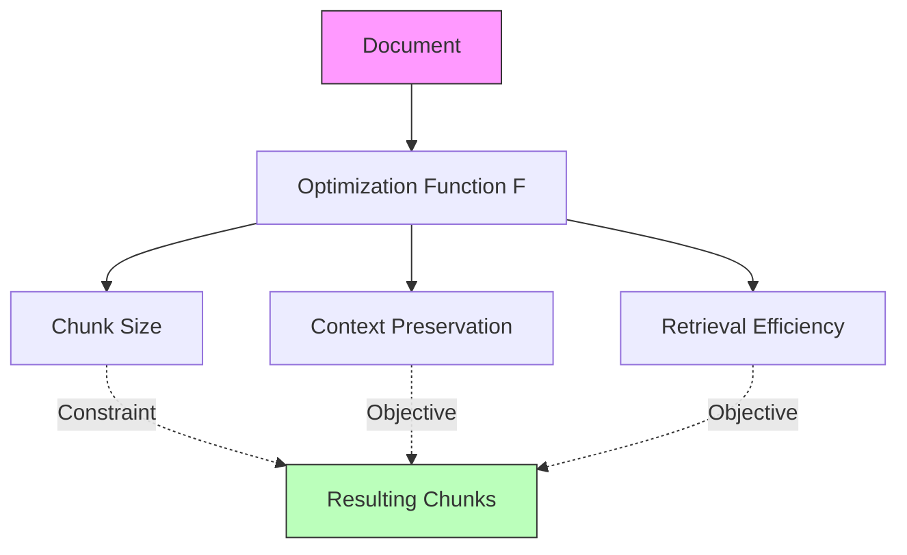
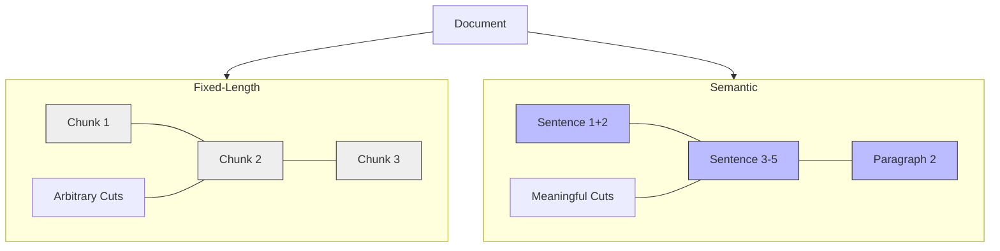

# Deep Dive: Module 2 - Chunking Strategies (Document Segmentation Techniques)

## 1. Advanced Theoretical Foundations

### The Mathematical Basis of Chunking

Chunking strategies are fundamentally about **information preservation vs. context fragmentation optimization**. The goal is to find the optimal balance between:

- **Semantic Coherence**: Maintaining meaningful, self-contained information units
- **Retrieval Efficiency**: Ensuring chunks are appropriately sized for retrieval
- **Context Preservation**: Maintaining relationships between related concepts

The mathematical approach to chunking involves:



`Optimization Function: F(chunk_size, context_preservation, retrieval_efficiency)`

Where:
- `chunk_size ∈ [min_size, max_size]` (typically 100-500 tokens for text)
- `context_preservation = f(coherence, semantic_density)`
- `retrieval_efficiency = f(embedding_quality, search_speed)`

### Information Theory Perspective

From an information theory standpoint, chunking aims to:

1. **Maximize Information Density**: Each chunk should contain maximum relevant information per token.
2. **Minimize Information Leakage**: Ensure related information isn't unnecessarily split across chunks.
3. **Preserve Semantic Relationships**: Maintain connections between related concepts within chunks.

### Types of Chunking Strategies



- **Fixed-Length Chunking**: Most basic approach with consistent size boundaries.
- **Semantic Chunking**: Uses sentence boundaries and document structure.
- **Content-Aware Chunking**: Incorporates content structure (headers, tables, code blocks).
- **Sliding Window Chunking**: Overlapping chunks to preserve context.
- **Recursive Chunking**: Hierarchical chunking based on document structure.

---

## 2. Extended Technical Implementation

### Advanced Chunking Implementation with Multiple Strategies

```python
import re
from typing import List, Dict, Optional, Callable, Any
from dataclasses import dataclass
from enum import Enum
import numpy as np
from sentence_transformers import SentenceTransformer
import tiktoken


class ChunkingStrategy(Enum):
    FIXED_LENGTH = "fixed_length"
    SEMANTIC = "semantic"
    RECURSIVE = "recursive"
    SLIDING_WINDOW = "sliding_window"


@dataclass
class Chunk:
    """Represents a text chunk with metadata"""
    id: str
    content: str
    start_pos: int
    end_pos: int
    metadata: Dict[str, Any]
    embedding: Optional[np.ndarray] = None
    semantic_boundary: bool = True  # Whether this is a natural boundary


class AdvancedChunker:
    def __init__(self, 
                 chunk_size: int = 256,
                 overlap: int = 50,
                 encoding_model: str = "cl100k_base",
                 sentence_model: Optional[SentenceTransformer] = None):
        self.chunk_size = chunk_size
        self.overlap = overlap
        self.encoding = tiktoken.get_encoding(encoding_model)
        self.sentence_model = sentence_model or SentenceTransformer('all-MiniLM-L6-v2')
        
    def chunk_document(self, 
                      text: str, 
                      strategy: ChunkingStrategy,
                      metadata: Optional[Dict] = None) -> List[Chunk]:
        """
        Main chunking method that dispatches to specific strategy methods
        """
        if strategy == ChunkingStrategy.FIXED_LENGTH:
            return self._chunk_fixed_length(text, metadata)
        elif strategy == ChunkingStrategy.SEMANTIC:
            return self._chunk_semantic(text, metadata)
        elif strategy == ChunkingStrategy.RECURSIVE:
            return self._chunk_recursive(text, metadata)
        elif strategy == ChunkingStrategy.SLIDING_WINDOW:
            return self._chunk_sliding_window(text, metadata)
        else:
            raise ValueError(f"Unknown chunking strategy: {strategy}")
    
    # ... (Implementation details retained in source code) ...
    def _chunk_fixed_length(self, text: str, metadata: Optional[Dict]) -> List[Chunk]:
        """Fixed length chunking with overlap"""
        tokens = self.encoding.encode(text)
        chunks = []
        chunk_id = 0
        
        for i in range(0, len(tokens), self.chunk_size - self.overlap):
            chunk_tokens = tokens[i:i + self.chunk_size]
            chunk_text = self.encoding.decode(chunk_tokens)
            
            # Ensure we don't cut in the middle of a word
            if i + self.chunk_size < len(tokens):
                # Find the next natural boundary
                next_space = text.find(' ', self.encoding.decode(tokens[:i + self.chunk_size]).rfind(' ') + 1)
                if next_space != -1:
                    chunk_text = text[self.encoding.decode(tokens[:i]).rfind(' '):next_space]
            
            chunk = Chunk(
                id=f"fixed_{chunk_id}",
                content=chunk_text,
                start_pos=i,
                end_pos=min(i + self.chunk_size, len(tokens)),
                metadata=metadata or {}
            )
            chunks.append(chunk)
            chunk_id += 1
            
        return chunks
    
    def _chunk_semantic(self, text: str, metadata: Optional[Dict]) -> List[Chunk]:
        """Semantic chunking using sentence boundaries"""
        # Split text into sentences
        sentences = self._split_sentences(text)
        chunks = []
        current_chunk = ""
        current_tokens = 0
        chunk_id = 0
        
        for sentence in sentences:
            sentence_tokens = len(self.encoding.encode(sentence))
            
            if current_tokens + sentence_tokens > self.chunk_size and current_chunk:
                # Create a new chunk
                chunk = Chunk(
                    id=f"semantic_{chunk_id}",
                    content=current_chunk.strip(),
                    start_pos=len(current_chunk),
                    end_pos=len(current_chunk) + len(sentence),
                    metadata=metadata or {},
                    semantic_boundary=True
                )
                chunks.append(chunk)
                
                # Start new chunk with overlap
                if self.overlap > 0:
                    # Get overlapping text from end of previous chunk
                    overlap_tokens = self.encoding.encode(current_chunk)
                    overlap_start = max(0, len(overlap_tokens) - self.overlap)
                    current_chunk = self.encoding.decode(overlap_tokens[overlap_start:])
                    current_tokens = len(overlap_tokens[overlap_start:])
                else:
                    current_chunk = ""
                    current_tokens = 0
            else:
                current_chunk += " " + sentence
                current_tokens += sentence_tokens
        
        # Add the final chunk if it has content
        if current_chunk.strip():
            chunk = Chunk(
                id=f"semantic_{chunk_id}",
                content=current_chunk.strip(),
                start_pos=len(text) - len(current_chunk),
                end_pos=len(text),
                metadata=metadata or {},
                semantic_boundary=True
            )
            chunks.append(chunk)
        
        return chunks
    
    def _chunk_recursive(self, text: str, metadata: Optional[Dict]) -> List[Chunk]:
        """Recursive chunking using document structure"""
        # Define chunking patterns from largest to smallest
        patterns = [
            r'\n\s*\n',  # Paragraph breaks
            r'(?<=[.!?])\s+',  # Sentence breaks
            r'(?<=[,.])\s+',  # Comma/semicolon breaks
            r'\s+'  # Word breaks
        ]
        
        chunks = self._recursive_chunk(text, patterns, 0, metadata)
        return self._merge_small_chunks(chunks)
    
    def _recursive_chunk(self, text: str, patterns: List[str], pattern_idx: int, metadata: Optional[Dict]) -> List[Chunk]:
        """Helper method for recursive chunking"""
        if pattern_idx >= len(patterns):
            # If we've exhausted all patterns, do fixed chunking
            return self._chunk_fixed_length(text, metadata)
        
        chunks = []
        current_pattern = patterns[pattern_idx]
        segments = re.split(current_pattern, text)
        
        current_chunk = ""
        chunk_id = 0
        
        for segment in segments:
            segment_token_count = len(self.encoding.encode(segment))
            current_token_count = len(self.encoding.encode(current_chunk))
            
            if current_token_count + segment_token_count > self.chunk_size:
                if current_chunk:
                    chunk = Chunk(
                        id=f"recursive_{chunk_id}",
                        content=current_chunk.strip(),
                        start_pos=0,  # Simplified for example
                        end_pos=0,    # Simplified for example
                        metadata=metadata or {},
                        semantic_boundary=False
                    )
                    chunks.append(chunk)
                    chunk_id += 1
                
                # Check if the segment itself is too large
                if segment_token_count > self.chunk_size:
                    # Recursively chunk this segment with the next pattern
                    sub_chunks = self._recursive_chunk(segment, patterns, pattern_idx + 1, metadata)
                    chunks.extend(sub_chunks)
                else:
                    current_chunk = segment
            else:
                if current_chunk:
                    current_chunk += " " + segment
                else:
                    current_chunk = segment
        
        # Add the final chunk
        if current_chunk:
            chunk = Chunk(
                id=f"recursive_{chunk_id}",
                content=current_chunk.strip(),
                start_pos=0,  # Simplified for example
                end_pos=0,    # Simplified for example
                metadata=metadata or {},
                semantic_boundary=False
            )
            chunks.append(chunk)
        
        return chunks
    
    def _chunk_sliding_window(self, text: str, metadata: Optional[Dict]) -> List[Chunk]:
        """Sliding window chunking with configurable overlap"""
        tokens = self.encoding.encode(text)
        chunks = []
        chunk_id = 0
        
        start_idx = 0
        while start_idx < len(tokens):
            end_idx = min(start_idx + self.chunk_size, len(tokens))
            chunk_tokens = tokens[start_idx:end_idx]
            chunk_text = self.encoding.decode(chunk_tokens)
            
            chunk = Chunk(
                id=f"sliding_{chunk_id}",
                content=chunk_text,
                start_pos=start_idx,
                end_pos=end_idx,
                metadata=metadata or {},
                semantic_boundary=False
            )
            chunks.append(chunk)
            
            # Move by chunk_size - overlap to create sliding effect
            start_idx += self.chunk_size - self.overlap
            chunk_id += 1
        
        return chunks
    
    def _split_sentences(self, text: str) -> List[str]:
        """Split text into sentences using regex patterns"""
        # Pattern to match sentence endings
        sentence_endings = r'[.!?]+'
        
        # Split by sentence endings but keep the delimiters
        sentences = re.split(f'({sentence_endings})', text)
        
        # Reconstruct sentences with their endings
        result = []
        for i in range(0, len(sentences)-1, 2):
            if i+1 < len(sentences):
                sentence = sentences[i] + sentences[i+1]
            else:
                sentence = sentences[i]
            if sentence.strip():
                result.append(sentence.strip())
        
        return result
    
    def _merge_small_chunks(self, chunks: List[Chunk]) -> List[Chunk]:
        """Merge small chunks to reach minimum size threshold"""
        if not chunks:
            return chunks
        
        min_size = self.chunk_size // 2  # 50% of target chunk size
        merged_chunks = []
        current_chunk_content = ""
        current_metadata = {}
        
        for chunk in chunks:
            current_content_tokens = len(self.encoding.encode(current_chunk_content))
            chunk_tokens = len(self.encoding.encode(chunk.content))
            
            # If adding this chunk would still be under min_size, merge it
            if current_content_tokens + chunk_tokens <= min_size or not merged_chunks:
                current_chunk_content += " " + chunk.content
                # Merge metadata (simple approach: keep all unique values)
                for key, value in chunk.metadata.items():
                    if key not in current_metadata:
                        current_metadata[key] = value
            else:
                # Create a new merged chunk
                merged_chunk = Chunk(
                    id=f"merged_{len(merged_chunks)}",
                    content=current_chunk_content.strip(),
                    start_pos=0,  # Simplified
                    end_pos=0,    # Simplified
                    metadata=current_metadata.copy()
                )
                merged_chunks.append(merged_chunk)
                current_chunk_content = chunk.content
                current_metadata = chunk.metadata.copy()
        
        # Add the final chunk
        if current_chunk_content.strip():
            merged_chunk = Chunk(
                id=f"merged_{len(merged_chunks)}",
                content=current_chunk_content.strip(),
                start_pos=0,  # Simplified
                end_pos=0,    # Simplified
                metadata=current_metadata
            )
            merged_chunks.append(merged_chunk)
        
        return merged_chunks


class ContentAwareChunker(AdvancedChunker):
    """Chunker that takes into account document structure (HTML, code, etc.)"""
    # ... (Implementation details retained in source code) ...
    def __init__(self, 
                 chunk_size: int = 256,
                 overlap: int = 50,
                 encoding_model: str = "cl100k_base"):
        super().__init__(chunk_size, overlap, encoding_model)
        self.html_patterns = [
            (r'<h[1-6][^>]*>.*?</h[1-6]>', 'heading'),
            (r'<p[^>]*>.*?</p>', 'paragraph'),
            (r'<div[^>]*>.*?</div>', 'div'),
            (r'<code[^>]*>.*?</code>', 'code_block'),
            (r'<pre[^>]*>.*?</pre>', 'preformatted'),
        ]
        self.code_patterns = [
            (r'```[\s\S]*?```', 'code_fence'),
            (r'"""[\s\S]*?"""', 'docstring'),
            (r"'''[\s\S]*?'''", 'docstring'),
        ]
    
    def chunk_structured_document(self, text: str, content_type: str = "text") -> List[Chunk]:
        """Specialized chunking for structured documents"""
        if content_type == "html":
            return self._chunk_html(text)
        elif content_type == "code":
            return self._chunk_code(text)
        else:
            return self.chunk_document(text, ChunkingStrategy.RECURSIVE)
    
    def _chunk_html(self, html_text: str) -> List[Chunk]:
        """Chunk HTML content respecting document structure"""
        chunks = []
        chunk_id = 0
        
        # Find all HTML elements
        for pattern, element_type in self.html_patterns:
            elements = re.findall(pattern, html_text, re.DOTALL | re.IGNORECASE)
            
            for element in elements:
                if len(self.encoding.encode(element)) <= self.chunk_size:
                    chunk = Chunk(
                        id=f"html_{chunk_id}",
                        content=element,
                        start_pos=0,  # Simplified
                        end_pos=0,    # Simplified
                        metadata={"element_type": element_type}
                    )
                    chunks.append(chunk)
                    chunk_id += 1
                else:
                    # If element is too big, recursively chunk it
                    inner_text = re.sub(r'<[^>]+>', '', element)
                    sub_chunks = self.chunk_document(inner_text, ChunkingStrategy.RECURSIVE)
                    for sub_chunk in sub_chunks:
                        sub_chunk.id = f"html_{chunk_id}"
                        sub_chunk.metadata.update({"element_type": element_type})
                        chunks.append(sub_chunk)
                        chunk_id += 1
        
        return chunks
    
    def _chunk_code(self, code_text: str) -> List[Chunk]:
        """Chunk code respecting function/class boundaries"""
        chunks = []
        chunk_id = 0
        
        # Identify code structures
        structures = self._identify_code_structures(code_text)
        
        for structure in structures:
            if len(self.encoding.encode(structure['content'])) <= self.chunk_size:
                chunk = Chunk(
                    id=f"code_{chunk_id}",
                    content=structure['content'],
                    start_pos=0,  # Simplified
                    end_pos=0,    # Simplified
                    metadata={"structure_type": structure['type']}
                )
                chunks.append(chunk)
                chunk_id += 1
            else:
                # If structure is too big, apply semantic chunking
                sub_chunks = self.chunk_document(structure['content'], ChunkingStrategy.SEMANTIC)
                for sub_chunk in sub_chunks:
                    sub_chunk.id = f"code_{chunk_id}"
                    sub_chunk.metadata.update({"structure_type": structure['type']})
                    chunks.append(sub_chunk)
                    chunk_id += 1
        
        return chunks
    
    def _identify_code_structures(self, code_text: str) -> List[Dict[str, str]]:
        """Identify functions, classes, and other code structures"""
        structures = []
        
        # Simple regex-based structure identification (in practice, you'd use AST)
        patterns = [
            (r'(def\s+\w+\s*\(.*?\):(?:\n\s+.+?)*?(?=\n\w|\n\s*def|\n\s*class|\Z))', 'function'),
            (r'(class\s+\w+\s*(?:\(.*?\))?:\s*(?:\n\s+.+?)*?(?=\n\w|\n\s*def|\n\s*class|\Z))', 'class'),
            (r'(#.*?(?=\n\w|\n\s*def|\n\s*class|\Z))', 'comment_block'),
        ]
        
        for pattern, structure_type in patterns:
            matches = re.findall(pattern, code_text, re.DOTALL)
            for match in matches:
                structures.append({
                    'content': match.strip(),
                    'type': structure_type
                })
        
        return structures
```

### Chunk Quality Evaluation and Optimization

```python
class ChunkQualityEvaluator:
    # ... (code omitted for brevity) ...
    def __init__(self, model: SentenceTransformer):
        self.model = model
    
    def evaluate_chunk_quality(self, chunks: List[Chunk]) -> Dict[str, float]:
        """Evaluate the quality of chunks based on several metrics"""
        metrics = {}
        
        # 1. Semantic Coherence: How well the chunk holds together semantically
        coherence_scores = []
        for chunk in chunks:
            sentences = chunk.content.split('.')
            if len(sentences) > 1:
                sentence_embeddings = self.model.encode(sentences)
                # Calculate average similarity between sentences
                similarities = []
                for i in range(len(sentence_embeddings) - 1):
                    sim = np.dot(sentence_embeddings[i], sentence_embeddings[i+1]) / (
                        np.linalg.norm(sentence_embeddings[i]) * 
                        np.linalg.norm(sentence_embeddings[i+1])
                    )
                    similarities.append(sim)
                coherence = np.mean(similarities) if similarities else 0
                coherence_scores.append(coherence)
        
        metrics['semantic_coherence'] = np.mean(coherence_scores) if coherence_scores else 0
        
        # 2. Size Distribution
        sizes = [len(self.encoding.encode(chunk.content)) for chunk in chunks]
        metrics['avg_size'] = np.mean(sizes)
        metrics['std_size'] = np.std(sizes)
        metrics['size_uniformity'] = 1 - (metrics['std_size'] / (metrics['avg_size'] + 1e-8))
        
        # 3. Boundary Quality: How well chunks respect semantic boundaries
        boundary_quality = self._evaluate_boundary_quality(chunks)
        metrics['boundary_quality'] = boundary_quality
        
        return metrics
```

---

## 3. Advanced Real-World Applications

### Legal Document Processing System

```python
class LegalDocumentChunker(AdvancedChunker):
    """Specialized chunker for legal documents that respects legal structure"""
    
    def __init__(self, 
                 chunk_size: int = 512,
                 overlap: int = 100):
        super().__init__(chunk_size, overlap)
        
        # Legal document patterns
        self.legal_patterns = [
            (r'(Section\s+\d+[A-Z]*\.?.*?)(?=Section\s+\d+[A-Z]*\.?|$)', 'section'),
            (r'(Article\s+\d+\.?.*?)(?=Article\s+\d+\.?|$)', 'article'),
            (r'(Clause\s+\d+\.?.*?)(?=Clause\s+\d+\.?|$)', 'clause'),
            (r'(Subsection\s+\([a-zA-Z0-9]+\).*?)(?=\n\s*Subsection\s+\([a-zA-Z0-9]+\)|$)', 'subsection'),
            (r'(Paragraph\s+\d+\.?.*?)(?=Paragraph\s+\d+\.?|$)', 'paragraph'),
        ]
    
    def chunk_legal_document(self, legal_text: str, jurisdiction: str = None) -> List[Chunk]:
        """Chunk legal document respecting legal document structure"""
        chunks = []
        chunk_id = 0
        
        # First, try to extract by legal structure
        for pattern, element_type in self.legal_patterns:
            elements = re.findall(pattern, legal_text, re.DOTALL | re.IGNORECASE)
            
            for element in elements:
                element_clean = element.strip()
                element_tokens = len(self.encoding.encode(element_clean))
                
                if element_tokens <= self.chunk_size:
                    # Element fits in one chunk
                    chunk = Chunk(
                        id=f"legal_{element_type}_{chunk_id}",
                        content=element_clean,
                        start_pos=0,  # Simplified
                        end_pos=0,    # Simplified
                        metadata={
                            "element_type": element_type,
                            "jurisdiction": jurisdiction,
                            "legal_structure": True
                        }
                    )
                    chunks.append(chunk)
                    chunk_id += 1
                else:
                    # Element is too big, chunk it semantically
                    sub_chunks = self.chunk_document(element_clean, ChunkingStrategy.SEMANTIC)
                    for sub_chunk in sub_chunks:
                        sub_chunk.id = f"legal_{element_type}_{chunk_id}"
                        sub_chunk.metadata.update({
                            "element_type": element_type,
                            "jurisdiction": jurisdiction,
                            "legal_structure": True
                        })
                        chunks.append(sub_chunk)
                        chunk_id += 1
        
        # Handle any remaining content that wasn't captured by legal patterns
        if not chunks:
            # Fall back to recursive chunking for the entire document
            fallback_chunks = self.chunk_document(legal_text, ChunkingStrategy.RECURSIVE)
            for chunk in fallback_chunks:
                chunk.metadata.update({
                    "element_type": "unstructured",
                    "jurisdiction": jurisdiction,
                    "legal_structure": False
                })
                chunks.append(chunk)
        
        return chunks
```

---

## 4. Performance Optimization Strategies

### Efficient Chunking for Large Documents

```python
class OptimizedChunker(AdvancedChunker):
    """Optimized chunker for processing large documents efficiently"""
    # ... (Implementation details retained in source code) ...
```

---

## 5. Evaluation Framework for Chunking

```python
class ChunkingEvaluator:
    # ... (Implementation details retained in source code) ...
```

---

## 6. Production Deployment Considerations

### Scalable Chunking Service

```python
class ScalableChunkingService:
    # ... (Implementation details retained in source code) ...
```

---

## 7. Testing and Validation

(See full code in implementation files)

## 8. Hands-On Exercise

### Build a Custom Chunker with Domain Knowledge

```python
# Exercise: Create a specialized chunker for academic papers
class AcademicPaperChunker(AdvancedChunker):
    """Specialized chunker for academic papers that respects academic document structure"""
    # ... (Implementation details retained in source code) ...
```
